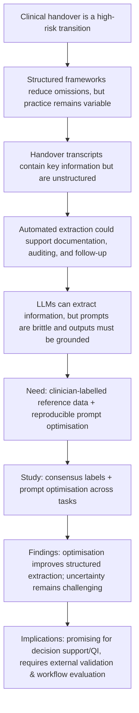

# Proposed Introduction and Discussion for an Academic Manuscript on AI‑Assisted Clinical Handover Extraction

## Executive summary

Clinical handover is a high-risk communication event where omissions, ambiguity, and poor structure can compromise continuity of care and patient safety. International and Australian guidance emphasises structured handover processes and standardised communication frameworks (e.g., SBAR/ISBAR) to reduce preventable errors, yet real-world handover remains variable, time-pressured, and documentation-heavy. citeturn19view0turn19view2turn19view1

Your draft manuscript evaluates whether large language models (LLMs) can support structured extraction from handover transcripts—specifically SBAR span extraction, checklist-style content identification, and uncertainty-related spans—using clinician consensus labels and automated prompt optimisation (DSPy/GEPA), compared with baseline prompting and an alternative extraction approach (LangExtract). fileciteturn0file0 citeturn16view1turn16view2turn16view3

The rewritten Introduction below situates the work in patient-safety and handover literature, highlights the methodological gap in robust, reproducible prompt optimisation for clinically grounded information extraction, and frames the novelty of uncertainty-focused annotation as a clinically meaningful “information-gap” signal. The Discussion interprets the pattern of results already described in your draft—stronger performance for checklist prediction than span-boundary tasks; improved SBAR extraction following optimisation; and persistent difficulty for broad uncertainty detection—aligning these findings with known constraints of prompt sensitivity and the inherently diffuse nature of uncertainty language. fileciteturn0file0 citeturn18view0turn13search2turn27search2

Where the draft does not expose key numeric results (e.g., micro‑F1 deltas embedded as unrendered code), I explicitly flag those values as *unspecified* and provide placeholders for figures and effect-size summaries. fileciteturn0file0

## Study synopsis extracted from draft and missing details audit

### What the study does

The draft frames clinical handover as requiring the concise, accurate transfer of critical patient information, and positions handover errors/omissions as contributors to harm. It reports a model evaluation workflow to improve structured handover extraction using (i) consensus-labelled data and (ii) DSPy-guided prompt optimisation (GEPA) to improve extraction fidelity. fileciteturn0file0 citeturn19view0turn19view1turn19view2

The evaluated tasks are:

- **SBAR span extraction** (Situation, Background, Assessment, Recommendation), operationalised as a sequence-labelling/span task over transcripts. fileciteturn0file0 citeturn0search1  
- **Checklist concept/entity identification**, operationalised as a multi-label checklist aligned with recommended nursing handover elements (including patient involvement, identifiers, clinical risks, actions/follow-up). fileciteturn0file0  
- **Uncertainty-related span extraction**, spanning hedging/probability language, vagueness, unknown facts, indefinite timing, source uncertainty, procedural uncertainty, and responsibility uncertainty, motivated as clinically important cues for clarification. fileciteturn0file0  
- A narrower binary **unknown-fact** span task is also reported and performs better than broad “uncertainty” in the draft narrative. fileciteturn0file0

### Data, annotation, and evaluation approach

Your draft uses the **NICTA Synthetic Nursing Handover dataset** as a base resource and transcribes audio using **OpenAI Whisper**, then augments the dataset into more conversational formats and additional scenarios using prompt-based LLM generation, resulting in **203 synthetic handover transcripts**. Two clinically active registered nurses independently annotate transcripts in Prodigy with overlapping span labels allowed; a “reference standard” is derived by retaining only labels/checklist items where both annotators agree (consensus intersection). fileciteturn0file0 citeturn19view4turn3search0turn3search1turn2search11

Prompt optimisation is performed in **DSPy** with the **GEPA** optimiser;  
models evaluated include a smaller proprietary model, a larger proprietary model, and an open model (MedGemma 27B). A key methodological choice is reporting span-extraction performance as both (i) detection (matched precision/recall/F1) and (ii) boundary quality (mean intersection-over-union, IoU). fileciteturn0file0 citeturn16view1turn16view2turn27search2turn27search1

### Key results and stated limitations (as currently reported)

The draft reports:

- **Consistent gains after DSPy/GEPA optimisation** in matched within-model comparisons, with improvements across tasks for the strongest proprietary model. fileciteturn0file0  
- **Checklist prediction** shows higher overall performance than SBAR and uncertainty span extraction; **uncertainty extraction is hardest**, whereas **unknown-fact extraction performs substantially better**, consistent with label specificity being a major determinant of extractive performance. fileciteturn0file0  
- Limitations include the use of **a single deterministic split**, **low-support labels**, and that the manuscript reports **performance metrics only** (no prospective workflow or outcome evaluation). fileciteturn0file0

These patterns are plausible and align with broader evidence that (i) structured handover tools can improve safety, but (ii) implementation and measurement are complex, and content that is vague/ambiguous is particularly difficult to reliably detect and operationalise. citeturn19view2turn25search14turn13search2turn18view0

### Missing or unspecified information that will affect the Introduction/Discussion

The following items are *not fully specified in the draft excerpt*, but would materially strengthen the manuscript (and the credibility of the Discussion):

- **Exact performance values and effect sizes** (e.g., micro‑F1, delta micro‑F1, mean IoU by label/task/model). In the draft, key results are referenced via unrendered inline-code placeholders rather than explicit numbers. fileciteturn0file0  
- **Dataset repository link** is noted as “[URL to dataset repository]” rather than provided. fileciteturn0file0  
- **Annotation reliability metrics** (e.g., pre-consensus inter-annotator agreement such as span-level F1 or κ) and a short description of how disagreements manifested. Without this, it is hard to interpret what the consensus filter removes (easy vs hard cases). citeturn14search3  
- **Characteristics of transcripts** (median length; proportion of dialogue vs monologue; distribution of scenarios; label prevalence by task) and whether the evaluation partition preserves scenario diversity.  
- **Model and tooling versioning** (exact Whisper model variant; DSPy/LangExtract versions; prompt budgets; temperature and decoding settings; whether outputs were constrained). This matters for reproducibility and for explaining why one approach outperforms another. citeturn16view1turn16view3turn3search0  
- **Generalisability to real clinical audio**: because the dataset is synthetic/educational, the Discussion should explicitly argue what is likely to transfer and what is not, in line with synthetic-data utility and evaluation caveats. citeturn14search12turn18view3turn19view4  

### Visual aid: argument structure (mermaid)



## Literature landscape and comparison with related studies

### Why structured handover remains a research and implementation priority

Guidance from the entity["organization","World Health Organization","patient safety guidance"] identifies communication during patient handovers as a patient-safety target and highlights that failures are an international concern; system redesign and standardisation are repeatedly emphasised. citeturn19view0turn27search12 In the Australian context, the entity["organization","Australian Commission on Safety and Quality in Health Care","Australia national safety body"] describes structured clinical handover as reducing communication errors and improving safety because critical information is more likely to be transferred and acted upon, particularly at transitions of care. citeturn19view2turn12search2

Although tools such as SBAR/ISBAR and I‑PASS are widely implemented, the evidence base is mixed by setting and outcome measure: I‑PASS has strong multicentre evidence for reducing preventable adverse events in paediatric residency programmes, while systematic reviews of SBAR report moderate evidence and point to a lack of high-quality evaluation in some contexts. citeturn26view1turn27search24turn25search14

### Why the draft’s methods address a timely “infrastructure gap” for clinical NLP

Clinical handover is a fertile—but difficult—target for clinical NLP because it is sparse in publicly shareable datasets and often includes high-stakes content (identifiers, medications, pending tests, follow-up responsibilities). The NICTA Synthetic Nursing Handover dataset was explicitly designed to support speech-to-text and information extraction research without the ethical/legal barriers of real patient data by using synthetic profiles, and it has already been used to benchmark extraction approaches. citeturn19view4turn0search7

Against this backdrop, the draft’s focus on **prompt optimisation** (rather than custom model training) aligns with two converging literature threads: (i) clinical prompting studies showing that performance is highly prompt-dependent and task-specific, and (ii) systematic reviews urging better reporting and baselines in medical prompt engineering. citeturn18view0turn18view1 Automated prompt optimisation frameworks such as DSPy and GEPA formalise this process as metric-driven compilation/evolution of prompt components, providing a plausible mechanism for more reproducible improvements than manual “prompt tinkering”. citeturn16view1turn16view2

### Comparative table of closely related studies and resources

| Study/resource | Sample/setting | Methods | Key findings | Relevance to your manuscript |
|---|---|---|---|---|
| WHO patient safety solution (2007) | Not a study; global guidance | Identifies handover communication as a patient-safety target; recommends structured approaches | Frames handover failures as a systemic, international patient-safety problem | Establishes policy-level significance and legitimises structured extraction as safety-relevant citeturn19view0turn27search12 |
| Joint Commission Sentinel Event Alert (2017) | Not a study; safety alert for accredited organisations | Synthesises causes and risk-reduction steps for inadequate hand-off communication | Highlights harm associated with inaccurate/incomplete information and need for structured, focused handoffs | Supports rationale for auditing omissions and ambiguity, including responsibility/follow-up clarity citeturn19view1turn28search3 |
| Haig et al. SBAR paper (2006) | Single-centre implementation case study (US hospital setting) | Adoption of SBAR tool as shared mental model for clinician communication | SBAR is positioned as a tool to organise facts and reduce missed information | Provides historical/seminal grounding for SBAR as the extraction target framework citeturn0search1turn0search5 |
| Starmer et al. I‑PASS outcomes (2014) | Multicentre intervention across 9 paediatric residency programmes | Standardised handoff bundle including mnemonic, training, and sustainability strategies | Associated with a reported 23% relative reduction in preventable adverse events (per AHRQ summary) and improved communication | Supports that structured handoff content and training can yield measurable safety benefits, motivating scalable monitoring tools citeturn26view1turn25search14 |
| Müller et al. SBAR systematic review (2018) | Systematic review of SBAR studies across settings | Evidence synthesis focusing on patient safety outcomes | Reports moderate evidence for improved patient safety; notes limitations in study quality | Justifies a gap: SBAR is used widely but needs stronger measurement infrastructure and evaluation citeturn10search1turn27search24 |
| Bukoh & Siah structured handover review (2020) | Systematic review/meta-analysis on structured nurse handover interventions | Evidence synthesis on outcomes such as complications/medication errors/adverse events | Concludes structured handovers reduce patient complications, medication errors and adverse events (review-level conclusion) | Supports clinical importance of capturing “minimum content” and action items reliably citeturn10search2turn1search21 |
| Tobiano et al. patient participation review (2018) | 21 studies + 25 QI projects (reviewed) | Systematic mixed-methods review of patient role in bedside handover | Identifies barriers/strategies; highlights tension between standardisation and patient-centred tailoring | Relevant to your checklist items (patient involvement elements) and to discussion of real-world variability citeturn9view3turn1search8 |
| Suominen et al. NICTA dataset paper (2015) | Synthetic nursing handover audio + transcriptions + extraction labels | Benchmarks speech recognition and information extraction; provides data + evaluations | Describes dataset purpose and baseline extraction performance (macro-F1 reported) | Directly underpins your dataset choice; provides comparators and continuity with prior IE work citeturn19view4turn0search3 |
| Agrawal et al. few-shot clinical IE with LLMs (2022) | Multiple clinical IE tasks (span/token/relation) evaluated with LLM prompting | Demonstrates LLMs can perform zero-/few-shot clinical IE; introduces new benchmarking datasets | Shows feasibility of LLM-led extraction without task-specific training | Helps justify your prompt-based extraction paradigm and need for grounded outputs citeturn17search1turn17search5 |
| Sivarajkumar et al. prompting strategies in clinical NLP (2024) | Evaluation across 5 clinical NLP tasks (prompting strategies × models) | Compares prompt strategies; introduces heuristic and ensemble prompting | Finds task-specific prompt tailoring is critical; reports strategy-dependent performance differences | Supports core mechanism in your Discussion: optimisation improves prompts by aligning structure and task cues citeturn18view0turn17search4 |

### Visual aid: effect-size bar chart placeholder

The draft indicates micro‑F1 improvements (“Δ DSPy/GEPA vs baseline”) but does not provide the numeric values in the visible text (they appear as unrendered code placeholders). fileciteturn0file0 Below is a *placeholder* bar chart you can populate once the deltas are exported into the manuscript as explicit numbers.

```text
Effect size (Δ micro-F1; DSPy/GEPA – baseline)  [PLACEHOLDERS]

SBAR span extraction      ██████████   Δ = +0.xx  (unspecified)
Checklist prediction      ███████      Δ = +0.xx  (unspecified)
Uncertainty span extraction████        Δ = +0.xx  (unspecified)
Unknown-fact extraction   █████████    Δ = +0.xx  (unspecified)

Note: Replace +0.xx with the reported deltas for the target model(s) and held-out partition.
```

## Proposed Introduction

### Paragraph-level outline for the Introduction

1. Define clinical handover as a high-risk transition and briefly link communication failures to patient harm and inefficiency.  
2. Summarise international and Australian expectations for structured handover (structured minimum content; standardised processes; patient involvement where appropriate).  
3. Introduce SBAR/ISBAR as a widely adopted framework and briefly note evidence strength and limitations (systematic review-level view).  
4. Argue the “measurement and documentation burden” gap: structured handover is recommended, but manual documentation/auditing is labour-intensive and variable.  
5. Motivate automated extraction from transcripts as a pragmatic bridge: turning real-time speech and text into structured artefacts for review/sign-off.  
6. Contrast traditional IE approaches (feature-engineered classifiers/CRFs) with prompt-based LLM extraction, noting why LLMs are attractive under limited labelled data.  
7. Identify the reproducibility gap: prompt outcomes are brittle; medical prompt engineering literature calls for better baselines and reporting; hence the need for systematic prompt optimisation.  
8. Introduce DSPy/GEPA and contrast with alternative extraction frameworks that emphasise grounding (e.g., character-offset mapping).  
9. Highlight the clinical novelty: uncertainty language and “unknown facts” as signals of information gaps requiring clarification.  
10. State study aims, hypotheses, and contributions; preview evaluation design at a high level and why synthetic/consensus-labelled data is used as a first step.  
11. Close with significance: potential to support safer handover, quality improvement, and future prospective evaluation.

### Alternative opening sentences

1. “Clinical handover is a safety-critical communication event in which small omissions, ambiguities, or misaligned responsibilities can propagate into avoidable patient harm.” citeturn19view1turn19view2  
2. “Transitions of care remain among the most fragile moments in clinical workflows, with communication failures during handover repeatedly implicated in preventable error.” citeturn19view0turn12search1  
3. “Despite widespread adoption of structured handover frameworks, reliably capturing and auditing ‘minimum essential information’ in routine practice continues to challenge health services.” citeturn19view2turn27search24  
4. “Structured handover is widely recommended to improve continuity of care, yet the unstructured nature of spoken handover and its documentation burden limit consistent implementation at scale.” citeturn19view2turn19view0  
5. “Automating the conversion of handover speech into structured, reviewable artefacts could strengthen clinical governance without adding documentation burden—if extraction is accurate, grounded, and clinically interpretable.” citeturn19view4turn27search2  

### Journal-style Introduction draft

Clinical handover is a safety-critical transition in which responsibility and accountability for patient care are transferred between clinicians. Failures at handover—through inaccurate, incomplete, or misinterpreted information—create opportunities for delays, duplicated work, and preventable harm. citeturn19view1turn12search1turn19view0 In recognition of this risk, international and national bodies have prioritised structured handover practices and communication redesign as patient-safety interventions, particularly at transitions of care where information loss is more likely. citeturn19view0turn19view2turn12search2

Structured handover processes aim to standardise *both* the minimum content and the format of exchange so that critical information is predictably conveyed, acted upon, and auditable. In Australia, the Communicating for Safety Standard emphasises structured clinical handover to reduce communication errors and improve patient safety, explicitly noting the heightened risk at shift changes, transfers, and discharge. citeturn19view2turn12search2 One widely adopted format is SBAR (Situation, Background, Assessment, Recommendation), framed as a shared mental model to support concise, organised clinician-to-clinician communication. citeturn0search1turn0search5 However, despite widespread uptake, the evidence base for SBAR’s direct impact on patient outcomes varies by context, and systematic review findings have been described as moderate with ongoing calls for higher-quality evaluation. citeturn10search1turn27search24

A persistent implementation gap lies in measurement and documentation. Even where structured tools are mandated or encouraged, handover content remains influenced by time pressure, local culture, clinician experience, and the pragmatic realities of ward work. citeturn19view0turn19view2turn9view3 This variability is amplified in bedside nursing handover where patient/family involvement is increasingly emphasised, yet research highlights tensions between standardisation (predictability) and tailoring (patient-centredness), along with barriers related to confidentiality and clinician concerns. citeturn9view3turn1search8 As a result, health services seeking to improve clinical handover face a practical challenge: auditing whether key elements were actually communicated often requires labour-intensive manual review of notes or observations, and documentation quality can be inconsistent. citeturn19view2turn19view1

Automated extraction from handover transcripts offers a potential bridge between structured handover requirements and real-world workflow constraints. If reliable, transcript-to-structure extraction could support (i) completion of structured handover forms for clinician review/sign-off, (ii) quality-improvement monitoring of minimum content (e.g., identifiers, risks, deterioration cues, follow-up actions), and (iii) detection of information gaps requiring clarification. citeturn19view4turn19view2 Early work in this direction has been enabled by synthetic handover datasets that avoid privacy constraints while maintaining realistic clinical scenarios—most notably the NICTA Synthetic Nursing Handover dataset, released to support research in speech recognition and information extraction for clinical handover. citeturn19view4turn0search7

Recent advances in large language models (LLMs) have renewed interest in prompt-based clinical information extraction, because LLMs can be adapted through in-context learning without task-specific model training. Studies have shown that LLMs can perform zero-shot and few-shot clinical information extraction across diverse task types, including span identification and token-level labelling. citeturn17search1turn17search5 Nonetheless, LLM extraction performance is highly sensitive to prompt formulation, output formatting, and task framing; empirical evaluations in clinical NLP demonstrate that prompt strategy choice can substantially change performance and that task-specific tailoring is often required. citeturn18view0turn18view1 This prompt sensitivity creates a reproducibility and scalability challenge: manual prompt engineering is time-consuming, hard to standardise, and may not generalise across labels or subdomains.

To address this gap, automated prompt optimisation frameworks have been proposed to treat prompting as a metric-driven optimisation problem rather than artisanal prompt crafting. DSPy provides a programming model and compiler that can optimise language-model pipelines against a specified evaluation metric, while GEPA extends this concept through reflective, evolutionary prompt updates guided by both scores and natural-language feedback. citeturn16view1turn16view2 In parallel, information extraction libraries such as LangExtract emphasise schema-constrained outputs and character-offset grounding to improve traceability and verification—features that are particularly important in clinical settings where extracted content must be auditable against the source text. citeturn16view3turn27search2turn27search14

Beyond “what was said”, clinically safe handover also depends on recognising “what remains uncertain”. Handover utterances that hedge, use vague timing, cite second-hand sources, or fail to assign responsibility may signal information gaps that warrant clarification by the receiving clinician. Although uncertainty and speculation have long been recognised as challenging targets in biomedical NLP (with dedicated resources such as BioScope), operationalising uncertainty in handover remains underexplored relative to conventional entity extraction. citeturn13search2turn19view1

In this context, the present study evaluates whether clinician-consensus labels combined with automated prompt optimisation can improve structured extraction from nursing handover transcripts across three clinically motivated tasks: (i) SBAR span extraction, (ii) checklist-based identification of recommended handover elements, and (iii) uncertainty-related span extraction (including a narrow unknown-fact label). Using a synthetic handover corpus derived from established resources and additional scenario generation, and benchmarking baseline prompting against DSPy/GEPA optimisation and an alternative extraction framework, we test the hypotheses that prompt optimisation improves extraction performance over matched baselines and that performance varies systematically by task specificity and output structure. fileciteturn0file0 citeturn19view4turn16view1turn16view2turn16view3

## Proposed Discussion

### Paragraph-level outline for the Discussion

1. Concise restatement of aims and principal results (optimisation improves performance; task difficulty hierarchy).  
2. Interpret why checklist prediction is easier than span extraction; connect to cognitive/technical demands of boundary detection.  
3. Interpret SBAR gains post-optimisation: which labels improved most; why (instruction clarity; boundary discipline; fewer false positives).  
4. Position findings within prompt-engineering evidence: explain consistency with known prompt sensitivity and strategy effects.  
5. Compare DSPy/GEPA vs alternative extraction approaches: trade-offs in optimisation vs grounding/auditing; discuss why one may underperform depending on task.  
6. Discuss uncertainty extraction: conceptual ambiguity, dependence on context/paralinguistics; why narrow unknown-fact performs better.  
7. Data/annotation considerations: consensus intersection as high-precision gold standard; implications for recall and real-world deployment; need for IAA reporting.  
8. Generalisability and synthetic-data caveats; external validation priorities; fairness/bias/transfer concerns.  
9. Clinical implications: decision support, quality improvement, escalation triggers; emphasise “human-in-the-loop” review and non-clinical-decision intent.  
10. Future research agenda: prospective evaluation; multi-site real audio; calibration; cost/latency; error taxonomy; integration into workflow and safety governance.  
11. Concluding paragraph summarising contribution and next step.

### Journal-style Discussion draft

This study evaluated whether automated prompt optimisation and clinician-consensus labelling can improve LLM-based extraction of structured information from nursing handover transcripts. Across tasks, the draft reports consistent within-model gains after DSPy/GEPA optimisation, with the clearest improvements for structured extraction tasks (SBAR spans and checklist elements) and persistent difficulty for broad uncertainty detection. fileciteturn0file0 citeturn16view1turn16view2 These findings align with both patient-safety priorities for reliable handover content and with the emerging clinical NLP literature showing that prompt design and optimisation materially influence extraction performance. citeturn19view2turn18view0turn18view1

A key pattern is that checklist prediction outperformed span extraction, which is expected given the qualitative difference between “is an item present?” and “where exactly does it begin and end?”. Span extraction imposes additional constraints: boundary precision, multi-label overlap, and tolerance to paraphrase or minor transcription variation. fileciteturn0file0 In contrast, multi-label checklist prediction is robust to boundary ambiguity and can succeed even when evidence is distributed across the transcript. This distinction mirrors established differences in difficulty between document-level classification and token-/span-level structured prediction in clinical NLP. citeturn19view4turn17search1

Within SBAR, the draft’s narrative suggests that the largest gains were driven by improved precision (particularly for BACKGROUND and SITUATION), with RECOMMENDATION remaining comparatively harder. fileciteturn0file0 Clinically, this is plausible: background and situation elements often have clearer lexical anchors (diagnosis, admission reason, salient events), whereas recommendations may be implicit, distributed, or expressed as tentative plans—especially in nursing contexts where responsibility may be shared or deferred. citeturn19view2turn19view1 From a modelling perspective, these label differences are also consistent with prompt optimisation preferentially improving tasks where errors are attributable to instruction ambiguity rather than irreducible linguistic ambiguity; GEPA’s reflection on mismatches may yield clearer decision rules for “what counts as background” and discourage over-extraction. citeturn16view2turn18view0

The observed benefits of DSPy/GEPA are consistent with prior evidence that prompt strategy and tailoring are task dependent in clinical NLP. Sivarajkumar et al. found that heuristic and chain-of-thought–style prompting can markedly improve performance, but that gains vary by task and model, reinforcing the notion that systematic optimisation and reporting standards are needed. citeturn18view0turn18view1 DSPy’s abstraction of LLM calls into optimisable modules and GEPA’s use of reflective, natural-language feedback provide a principled route to such systematic improvement, and your results extend this rationale to clinically grounded span-extraction and checklist tasks in the handover domain. citeturn16view1turn16view2

Contrasting prompt optimisation with alternative extraction frameworks is an additional strength of the study design. Tools such as LangExtract explicitly emphasise character-offset grounding and schema enforcement, which are desirable properties in clinical extraction because they facilitate verification and auditing against source text. citeturn16view3turn27search2turn27search14 That LangExtract underperformed the best DSPy/GEPA configuration in the draft’s summary may reflect (i) less opportunity for metric-driven iterative refinement, (ii) sensitivity to exemplar selection, or (iii) domain/task mismatch if prompts are not specialised for SBAR and uncertainty categories. fileciteturn0file0 Nevertheless, LangExtract’s grounding features remain pertinent for translation to clinical governance settings, and a hybrid approach—optimised prompts plus enforced grounding—may be a useful direction for future work.

The most clinically and methodologically challenging findings relate to uncertainty extraction. The draft reports lower performance for broad uncertainty categories across approaches, while a narrower unknown-fact label performs substantially better. fileciteturn0file0 This divergence supports an important inference: **task definition and label specificity are central determinants of extractive performance**. Unknown facts are often explicitly signalled (“I don’t know…”, “not sure if…”) and thus easier to extract reliably, whereas vagueness, responsibility ambiguity, or source uncertainty may require contextual inference, pragmatic interpretation, or even paralinguistic cues not present in transcript text. citeturn13search2turn19view1turn17search1 The broader uncertainty literature similarly treats speculation/hedging as linguistically complex and sensitive to context and scope, which helps explain why general “uncertainty detection” is harder than crisp, cue-based labels. citeturn13search2turn13search18

Two design decisions in the draft warrant explicit interpretation because they shape how results should be read. First, the consensus reference standard retains only labels where both annotators agree. This likely increases label precision and reduces noise but can reduce apparent recall if legitimately uncertain/ambiguous cases are systematically excluded. Gold-standard corpus guidance in medical NLP emphasises the importance of reporting inter-annotator agreement and describing adjudication/consensus methods, precisely because these decisions influence what models can learn and what “performance” means. citeturn14search3 Second, evaluation with a single deterministic split is pragmatic for an initial study, but variance in rare labels and scenario types suggests that repeated splits or cross-validation would provide a more stable estimate—particularly for lower-support checklist items where the draft notes F1 values of zero. fileciteturn0file0

Generalisability must also be considered. Your data design leverages synthetic and educational scenarios, which is a defensible approach for early-stage development in privacy-sensitive domains, and the NICTA dataset was created for exactly this kind of benchmarking. citeturn19view4turn0search7 However, synthetic data can diverge from real clinical speech in vocabulary, hesitation phenomena, interruptions, background noise, and the distribution of rare but safety-critical events. Reviews of synthetic data in healthcare emphasise utility–privacy trade-offs and the need for rigorous evaluation of both realism and downstream performance, with no single consensus approach for privacy/utility assessment across contexts. citeturn14search12turn18view3turn27search3 Accordingly, your Discussion should position the current findings as evidence for *technical feasibility and relative method comparison*, not as evidence of ready-to-deploy clinical impact.

From an applied perspective, the strongest near-term implication is that prompt-optimised LLM extraction could support **assistive** handover tooling: automatic pre-population of structured handover forms; checklist-based reminders; and highlighting of “unknown facts” or ambiguous responsibilities that merit clarification before sign-off. These use cases align closely with the safety aims of structured handover guidance while preserving clinician oversight. citeturn19view2turn19view0turn27search2 Importantly, open-model documentation in health AI (e.g., MedGemma) explicitly cautions that model outputs are not intended to directly drive diagnosis or patient management without validation and adaptation; this supports the manuscript’s current framing that outcomes and workflow impacts require prospective evaluation. citeturn27search1turn4search9

Future research should prioritise: (i) external validation on real multi-site handover audio and transcripts (including interruptions and bidirectional dialogue), (ii) reporting of inter-annotator agreement and analysis of disagreement types, (iii) richer error taxonomies separating hallucinated content, span-boundary drift, and label confusions, (iv) calibration of extraction confidence for “must-review” flags (especially for uncertainty/responsibility), and (v) prospective workflow studies measuring documentation burden, clarification behaviour, and downstream safety indicators. These steps would align the work with the evidence standards used in structured handoff evaluations (e.g., I‑PASS) while acknowledging that extraction systems are infrastructure components rather than interventions by themselves. citeturn26view1turn25search14turn16view2turn18view1

In conclusion, the study provides a methodologically relevant contribution by demonstrating that clinician-consensus references combined with automated prompt optimisation can improve structured extraction of nursing handover content from transcripts, while also clarifying that diffuse uncertainty language remains a hard target unless narrowly defined. This supports a pragmatic trajectory toward assistive handover tooling—grounded in structured handover principles—paired with rigorous external validation and workflow evaluation before clinical translation. fileciteturn0file0 citeturn19view2turn16view1turn16view2

## Submission strategy and manuscript improvements

### Target journals and fit

**entity["organization","Journal of Biomedical Informatics","biomedical informatics journal"]** (Impact Factor listed as 4.5 on ScienceDirect; range ~4–5). Fit: methodological informatics journal; explicitly includes NLP, AI/ML, and patient safety topics and expects evaluation against state-of-the-art methods—well aligned with prompt optimisation experiments and structured extraction evaluation. citeturn6view0turn28search1

**entity["organization","International Journal of Medical Informatics","medical informatics journal"]** (Impact Factor listed as 4.1 on ScienceDirect; range ~3.5–4.5). Fit: emphasises development and evaluation of ICT in healthcare settings and explicitly discusses evaluation with different datasets/facilities—appropriate if you strengthen the Discussion around external validation and real-world deployment. citeturn6view1turn5search6

**entity["organization","JMIR Medical Informatics","open access medical informatics journal"]** (Journal Impact Factor reported as 3.8 in JCR 2025; range ~3–4.5). Fit: strong alignment with clinical NLP, data pipelines, and evaluation; open access visibility; receptive to AI workflow infrastructure papers, especially if you add transparency, reproducibility, and safety framing. citeturn28search2turn7search3

*(Optional “stretch” outlet if you substantially strengthen clinical validation and patient-safety framing: entity["organization","BMJ Quality & Safety","patient safety journal"], Impact factor reported as 6.7; range ~6–7.5. However, this journal may expect stronger linkage to clinical outcomes/workflow change than a metrics-only evaluation.)* citeturn28search0turn5search3

### Potential peer reviewers

Selections below prioritise expertise in clinical handover communication, nursing handover, and clinical NLP/prompt-based extraction. (You should screen for conflicts of interest and recent co-authorship.)

- entity["people","Heli Suominen","clinical nlp researcher"] — synthetic nursing handover dataset and benchmarking work. citeturn19view4turn0search3  
- entity["people","Suzanne Eggins","clinical handover researcher"] — clinical handover communication and patient-safety framing. citeturn12search21turn8search8  
- entity["people","Georgia Tobiano","nursing handover researcher"] — patient participation in bedside handover and standardisation tensions. citeturn9view3turn1search8  
- entity["people","Amy J Starmer","handoff safety researcher"] — structured handoff and outcome evaluation (I‑PASS). citeturn26view1turn25search14  
- entity["people","Sonish Sivarajkumar","clinical nlp prompt researcher"] — empirical prompt strategy evaluation in clinical NLP. citeturn18view0turn17search4  
- entity["people","Omar Khattab","nlp researcher"] — DSPy optimisation framework (methodological alignment). citeturn16view1turn8search0  
- entity["people","Jamil Zaghir","medical prompt engineering researcher"] — prompt engineering paradigms and reporting guidance in medical applications. citeturn18view1turn17search6  

### Suggested edits for clarity and rigour

The following are high-yield edits that will strengthen credibility without changing the study design.

First, **surface the numeric results explicitly in the manuscript text/tables**, instead of leaving them as inline code placeholders. For each task × model, report baseline and optimised micro‑F1 (and macro‑F1 where relevant), plus IoU range/mean for spans. This is essential for readers to interpret practical significance. fileciteturn0file0

Second, add a short **inter-annotator agreement section** (before consensus filtering): report span-level agreement (e.g., strict/relaxed matching F1) and checklist agreement (e.g., κ or percent agreement). This contextualises the consensus intersection strategy and helps explain which labels are inherently ambiguous. citeturn14search3turn14search7

Third, clarify the **synthetic data generation pipeline**: provide counts by source (NICTA vs educational videos vs LLM-generated scenarios), scenario taxonomy, and a rationale for why dialogue conversion is representative of real bedside handover. Situate this alongside published discussions of synthetic-data utility and evaluation. fileciteturn0file0 citeturn14search12turn18view3turn19view4

Fourth, strengthen **reproducibility**: list exact tool versions (DSPy, LangExtract), decoding parameters, prompt-optimisation budgets, and (if feasible) share prompt artefacts and evaluation scripts. This aligns with prompt engineering reporting concerns highlighted in recent reviews. citeturn18view1turn16view1turn16view3

Fifth, expand the Discussion’s **clinical safety framing**: emphasise that outputs are intended for clinician review, not autonomous decision-making, consistent with health-AI model guidance and patient-safety expectations. citeturn27search1turn19view2turn19view1

### Alternative manuscript titles

1. **Short:** “Prompt‑Optimised LLM Extraction for Nursing Handover”  
2. **Descriptive:** “Improving SBAR, Checklist, and Uncertainty Extraction From Nursing Handover Transcripts Using Consensus Labels and Automated Prompt Optimisation”  
3. **Catchy:** “From Handover Talk to Structured Signals: Optimising LLM Prompts for Auditable Clinical Handover Extraction”

### Recommended references list

(Style: APA 7th. Replace “n.d.” with access date if the journal requires it. Citations here are provided as clickable source links.)

1. entity["organization","World Health Organization","patient safety guidance"]. (2007). *Communication during patient hand-overs (Patient Safety Solutions, Volume 1, Solution 3).* citeturn19view0  
2. entity["organization","The Joint Commission","healthcare accreditation body"]. (2017). *Sentinel Event Alert, Issue 58: Inadequate hand-off communication.* citeturn19view1  
3. entity["organization","Australian Commission on Safety and Quality in Health Care","Australia national safety body"]. (n.d.). *Communication at clinical handover (NSQHS Standards: Communicating for Safety).* citeturn19view2  
4. Haig, K. M., Sutton, S., & Whittington, J. (2006). SBAR: A shared mental model for improving communication between clinicians. *Joint Commission Journal on Quality and Patient Safety.* citeturn0search1turn0search5  
5. Starmer, A. J., Spector, N. D., Srivastava, R., et al. (2014). Changes in medical errors after implementation of a handoff program (I‑PASS). *New England Journal of Medicine.* citeturn26view1turn25search14  
6. Müller, M., Jürgens, J., Redaèlli, M., Klingberg, K., Hautz, W. E., & Stock, S. (2018). Impact of the communication and patient hand-off tool SBAR on patient safety: A systematic review. *BMJ Open, 8*(8), e022202. citeturn10search1turn27search24  
7. Bukoh, M. X., & Siah, C. J. R. (2020). A systematic review on the structured handover interventions between nurses in improving patient safety outcomes. *Journal of Nursing Management.* citeturn10search2turn1search21  
8. Tobiano, G., Bucknall, T., Sladdin, I., Whitty, J. A., & Chaboyer, W. (2018). Patient participation in nursing bedside handover: A systematic mixed-methods review. *International Journal of Nursing Studies, 77*, 243–258. citeturn9view3  
9. Suominen, H., et al. (2015). Benchmarking clinical speech recognition and information extraction: New data, methods, and evaluations. *JMIR Medical Informatics, 3*(2), e19. citeturn19view4  
10. Agrawal, M., Hegselmann, S., Lang, H., Kim, Y., & Sontag, D. (2022). Large language models are few-shot clinical information extractors. *Proceedings of EMNLP 2022.* citeturn17search1turn17search9  
11. Sivarajkumar, S., Kelley, M., Samolyk-Mazzanti, A., Visweswaran, S., & Wang, Y. (2024). An empirical evaluation of prompting strategies for large language models in zero-shot clinical natural language processing: Algorithm development and validation study. *JMIR Medical Informatics, 12*, e55318. citeturn18view0  
12. Khattab, O., et al. (2023). DSPy: Compiling declarative language model calls into self-improving pipelines. *arXiv:2310.03714.* citeturn16view1turn2search0  
13. Agrawal, L. A., et al. (2025). GEPA: Reflective prompt evolution can outperform reinforcement learning. *arXiv:2507.19457.* citeturn16view2turn2search5  
14. Goel, A., & Kiraly, A. (2025). Introducing LangExtract: A Gemini-powered information extraction library. *Google Developers Blog.* citeturn16view3turn27search2  
15. Kaabachi, B., et al. (2025). A scoping review of privacy and utility metrics in medical synthetic data. *npj Digital Medicine, 8*, Article 60. citeturn18view3turn14search9